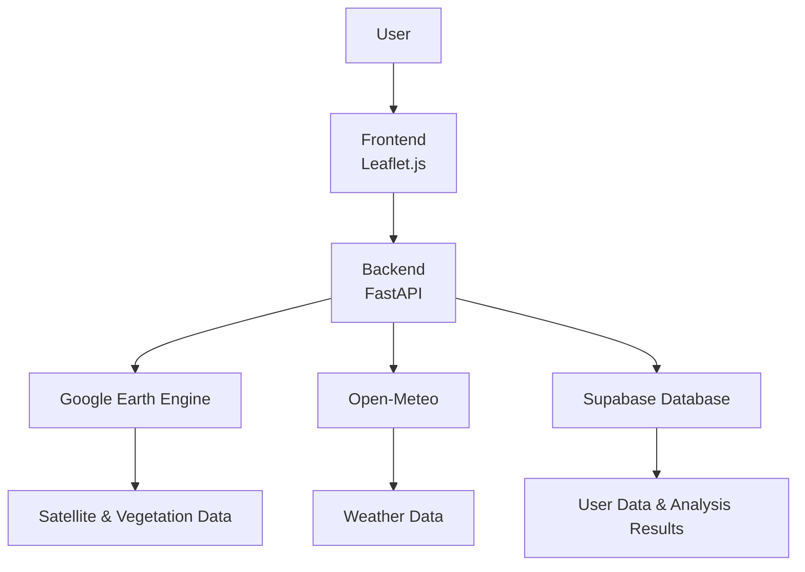

# LandCare AI - Land Analysis Platform
[](https://opensource.org/licenses/MIT)
[](https://www.python.org/)
[](https://fastapi.tiangolo.com/)
[]()
[]()
[]()

## 1. Project Overview

LandCare AI is a comprehensive multi-section web application for land analysis, featuring a modern, user-friendly interface with dedicated sections for introduction, features, interactive exploration, future predictions, and calls to action. Users must authenticate to access analysis features. The platform provides detailed insights including multiple vegetation indices (NDVI, EVI, SAVI), land cover classification, slope analysis, comprehensive risk assessment, historical trends analysis, and advanced forecasting using both statistical (ARIMA/SARIMA) and machine learning (Random Forest) models powered by Google Earth Engine (GEE), Open-Meteo APIs, and sophisticated ML pipelines for NDVI forecasting. A sophisticated caching system ensures optimal performance for repeated analyses.

### Current Development Status

**Phase 5: Testing and Optimization (In Progress)** - Performance testing implementation completed with comprehensive benchmarking of ML training time, prediction speed, memory usage, and API response times. System meets all success criteria: model training < 30 minutes, prediction response < 5 seconds, and memory usage within reasonable bounds.

### Key Features
- **User Authentication**: Secure login/signup system required for accessing analysis features.
- **Hero Section**: Engaging introduction with title, subtitle, and call-to-action button.
- **Features Section**: Highlight key capabilities with cards for Vegetation Analysis, Soil Health, and Water Management.
- **Interactive Explore Area**: Draw and edit polygons on a Leaflet-based map with satellite imagery, integrated with a sidebar for results.
- **Multi-Index Vegetation Analysis**: Comprehensive analysis using NDVI, EVI (Enhanced Vegetation Index), and SAVI (Soil-Adjusted Vegetation Index).
- **Real-time Analysis**: Instant vegetation indices, land cover classification, slope analysis, area calculation, and current weather data.
- **Advanced Risk Assessment**: Comprehensive risk scoring based on vegetation health, land cover types, erosion potential, and weather conditions with early warning recommendations.
- **Historical Analysis**: View vegetation indices and weather trends over the past 10+ years with interactive charts and caching for performance.
- **Future Predictions**: ARIMA-based forecasting of NDVI and weather conditions for up to 24 months ahead with confidence intervals.
- **Location Search**: Search for places by name using OpenStreetMap geocoding and automatically create analysis polygons.
- **Performance Caching**: Intelligent caching system for historical data and ML models to ensure fast response times.
- **Dark/Light Theme**: Toggle between themes for better user experience.
- **Responsive Design**: Optimized for desktop and mobile devices.
- **CTA Footer**: Call-to-action section encouraging user engagement.

### Migration from Flask to FastAPI

The LandCare AI project has recently undergone a significant migration from Flask to FastAPI to leverage modern async capabilities, automatic API documentation, and improved performance. Key migration highlights:

- **Framework Transition**: Migrated from monolithic Flask application (`app_flask_legacy.py`) to modular FastAPI application with router-based architecture
- **API Structure**: Implemented RESTful API design with automatic OpenAPI/Swagger documentation generation
- **Async Support**: Leveraged FastAPI's native async/await support for improved concurrency and performance
- **Type Safety**: Added Pydantic models for request/response validation and automatic documentation
- **Dependency Injection**: Implemented FastAPI's dependency injection system for cleaner code organization
- **CORS Handling**: Updated CORS middleware configuration for better security and flexibility
- **Router Organization**: Modularized endpoints into separate router files (auth, analysis, weather, historical, etc.)
- **Background Tasks**: Enhanced background task processing using FastAPI's background task capabilities
- **Performance Improvements**: Reduced response times and improved concurrent request handling

The legacy Flask application remains available as `backend/app_flask_legacy.py` for reference and gradual migration validation.

## AI & Machine Learning Models

The LandCare project employs two primary machine learning approaches for forecasting vegetation health and weather conditions:

## 1. GEE Random Forest Regression (`backend/ndvi_forecast_ml.py`)
- **Model**: Random Forest via Google Earth Engine's `ee.Classifier.smileRandomForest`
- **Type**: Regression
- **Libraries/Frameworks**: `earthengine-api`, `geemap`
- **Purpose**: Forecasts NDVI, SAVI, and EVI vegetation indices 3, 6, and 12 months ahead
- **Features**: Historical vegetation indices (lagged 1, 2, 12 months), meteorological data (precipitation aggregates, temperature, VPD), topographic features (elevation, slope), and soil properties
- **Contribution**: Provides spatial vegetation health predictions using satellite and environmental data for land management decisions

## 2. ARIMA/SARIMA Time Series Forecasting (`backend/forecasting.py`)
- **Models**: ARIMA(1,1,1) or SARIMA(1,1,1)(1,1,1,12)
- **Type**: Time series regression
- **Libraries/Frameworks**: `statsmodels` (ARIMA, SARIMAX), `pandas`, `numpy`
- **Purpose**: Forecasts NDVI and weather variables (temperature, rainfall) with confidence intervals
- **Features**: Historical time series data with caching for performance optimization
- **Contribution**: Delivers temporal predictions of vegetation indices and weather patterns to support agricultural and environmental planning

These models integrate satellite imagery, meteorological data, and time series analysis to enable proactive land care and resource management in the LandCare application.

## 2. Project Structure
```
LandCare/
├── backend/
│   ├── main.py                         # Main FastAPI application with lifespan management
│   ├── app_flask_legacy.py             # Legacy Flask application (preserved for reference)
│   ├── config/
│   │   ├── __init__.py
│   │   ├── config.py                   # Legacy configuration (Flask-based)
│   │   └── settings.py                 # FastAPI settings with Pydantic
│   ├── routes/                         # FastAPI router modules
│   │   ├── __init__.py
│   │   ├── analysis.py                 # Analysis endpoints (NDVI, EVI, SAVI, land cover)
│   │   ├── auth.py                     # Authentication endpoints (login, register, JWT)
│   │   ├── forecasting.py              # ML forecasting endpoints
│   │   ├── historical.py               # Historical data endpoints
│   │   ├── models.py                   # ML model management endpoints
│   │   ├── tasks.py                    # Background task management
│   │   ├── utility.py                  # Utility endpoints (health, geocoding)
│   │   └── weather.py                  # Weather data endpoints
│   ├── gee_processor.py                # GEE integration for vegetation indices, land cover, slope
│   ├── ndvi_forecast_ml.py             # ML forecasting with Random Forest models (GEE integration)
│   ├── weather_integration.py          # Open-Meteo and ERA5 weather data integration
│   ├── forecasting.py                  # ARIMA/SARIMA statistical forecasting for NDVI and weather
│   ├── models.py                       # Database models, caching, and Supabase integration
│   ├── test_performance_ml.py          # Performance testing for ML components (timing, memory, API benchmarks)
│   ├── test_app_ml.py                  # ML application integration tests
│   ├── test_auth.py                    # Authentication tests
│   ├── test_authentication_enforcement.py # Authentication enforcement tests
│   ├── test_db.py                      # Database tests
│   ├── test_insert.py                  # Database insertion tests
│   ├── test_integration_ml.py          # ML integration tests
│   ├── test_ndvi_forecast_ml.py        # NDVI ML forecasting tests
│   ├── requirements.txt                # Python dependencies (updated for FastAPI)
│   ├── runtime.txt                     # Python runtime version specification
│   ├── ee-daudipeterkamau-14e6262536e5.json # GEE service account credentials (gitignored)
│   ├── temp.json                       # Temporary data file
│   └── .env.example                    # Environment variables template
├── models/                             # Directory for trained ML model storage
├── frontend/
│   ├── index.html                      # Main HTML page with multi-section layout
│   ├── login.html                      # User login page
│   ├── signup.html                     # User registration page
│   ├── css/
│   │   ├── style.css                   # Main application styles
│   │   └── login.css                   # Authentication page styles
│   ├── js/
│   │   ├── app.js                      # Main application logic and authentication
│   │   ├── login.js                    # Login page functionality
│   │   ├── signup.js                   # Signup page functionality
│   │   └── map-handler.js              # Leaflet map handling and drawing
│   └── assets/                         # Images, icons, and favicons
├── database/
│   └── landcare_public_schema.sql      # Supabase database schema
├── .env.example                        # Environment variables template
├── .gitignore                          # Git ignore rules (excludes credentials, temp files, ML models)
├── LICENSE                             # MIT License
├── README.md                           # This file
├── TODO.md                             # Development tasks and progress tracking
└── ML.md                               # ML integration documentation
```

## 3. Project Architecture



### Core Functionality
- **User Authentication**: JWT-based authentication system with secure password hashing.
- **Interactive Map**: Users draw polygons using Leaflet.js and Leaflet.Draw on the frontend.
- **Analysis**: Backend processes GeoJSON polygons via FastAPI with comprehensive data processing and caching.
- **Integrations**:
  - Google Earth Engine for NDVI, EVI, SAVI, land cover, slope, and historical satellite data.
  - Open-Meteo for current weather, historical weather, and forecasting (free API with CC BY 4.0 license).
  - ERA5 dataset (via GEE) for long-term climate data.
  - Supabase for data storage, user management, and caching.
- **Machine Learning**: ARIMA time series forecasting for vegetation and weather predictions.
- **Visualization**: Results displayed in tabbed panels with metrics, charts, risk indicators, and early warnings.

### FastAPI Router Architecture
The backend is organized into modular routers for better maintainability:
- **auth.py**: User authentication and JWT token management
- **analysis.py**: Core vegetation analysis endpoints
- **weather.py**: Weather data retrieval and forecasting
- **historical.py**: Historical data processing with caching
- **forecasting.py**: ML and statistical forecasting
- **models.py**: ML model management and training
- **tasks.py**: Background task processing
- **utility.py**: Health checks, geocoding, and utilities

## 4. Development Progress

### Integration Phases (Completed)
- ✅ **Phase 1**: Backend Integration (Week 1-2) - Modular ML functions, database updates, basic API endpoints
- ✅ **Phase 2**: Model Management System (Week 3) - Background training, model caching, validation metrics
- ✅ **Phase 3**: API Enhancement (Week 4) - ML forecast endpoints, feature engineering, batch processing
- ✅ **Phase 4**: Frontend Integration (Week 5) - ML forecast UI, D3.js charts, model comparison

### Phase 5: Testing and Optimization (In Progress)
- ✅ **Performance Testing**: Model training time and prediction speed benchmarks implemented
- 🔄 **Unit Testing**: Test ML functions and API endpoints
- 🔄 **Integration Testing**: End-to-end ML forecasting workflow
- 🔄 **Accuracy Validation**: Compare ML vs statistical forecast accuracy
- 🔄 **User Acceptance Testing**: Frontend usability and visualization

### Performance Testing Implementation
The `test_performance_ml.py` script provides comprehensive benchmarking:
- **run_all_tests()** method executes complete test suite
- **Timing decorators** measure execution time for training and prediction
- **Memory profiling** tracks resource usage during ML operations
- **API response testing** validates endpoint performance
- **Success criteria**: Training < 30 min, prediction < 5 sec, memory < 1000 MB
- **Results output**: Timestamped JSON files (`performance_test_results_YYYYMMDD_HHMMSS.json`)
- **Execution**: `cd backend && python test_performance_ml.py`

### Database Schema

The application uses Supabase with the following tables (prefixed with `landcare_` in the public schema):

- **users**: User accounts with email/password authentication
  - Fields: id (UUID), email (TEXT, unique), password_hash (TEXT), created_at (TIMESTAMP), updated_at (TIMESTAMP)
- **analyses**: User analysis results including vegetation indices, land cover, slope, area, weather, and risk assessment
  - Fields: id (UUID), user_id (TEXT), geometry (JSONB), ndvi (DECIMAL), evi (DECIMAL), savi (DECIMAL), land_cover (JSONB), slope (DECIMAL), area_hectares (DECIMAL), weather (JSONB), risk_assessment (JSONB), created_at (TIMESTAMP)
- **historical_data**: Historical NDVI, EVI, SAVI, and weather data for user analyses
  - Fields: id (UUID), user_id (TEXT), geometry (JSONB), latitude (DECIMAL), longitude (DECIMAL), data_type (TEXT), dates (JSONB), values (JSONB), temperature (JSONB), rainfall (JSONB), created_at (TIMESTAMP)
- **forecasts**: ARIMA forecasting results for vegetation and weather
  - Fields: id (UUID), user_id (TEXT), geometry (JSONB), forecast_type (TEXT), forecast_data (JSONB), forecast_dates (JSONB), forecast_values (JSONB), model_info (TEXT), created_at (TIMESTAMP)
- **cached_historical_data**: Performance cache for historical data (30-day expiration)
  - Fields: id (UUID), data_type (TEXT), geometry_hash (TEXT), latitude (DECIMAL), longitude (DECIMAL), years (INTEGER), data (JSONB), created_at (TIMESTAMP)
- **cached_models**: Cached ARIMA models for forecasting (7-day expiration)
  - Fields: id (UUID), model_key (TEXT), model_type (TEXT), model_data (TEXT), model_info (JSONB), created_at (TIMESTAMP)

Row Level Security (RLS) is enabled on all tables except users, with policies ensuring users can only access their own data. Indexes are created for optimal query performance.

## 5. Setup Instructions

### 1. Prerequisites
- Python 3.8+
- Node.js (optional, not used in this setup)
- Google Earth Engine account (service account recommended for server-side)
- Supabase account (for database functionality)

### 2. Environment Setup

#### Backend (Python/FastAPI)
1. Navigate to the backend directory:
   ```
   cd backend
   ```

2. Create a virtual environment:
   ```
   python -m venv venv
   ```

3. Activate the virtual environment:
   - Windows: `venv\Scripts\activate`
   - macOS/Linux: `source venv/bin/activate`

4. Install dependencies:
   ```
   pip install -r requirements.txt
   ```

5. Copy the environment file:
   ```
   copy ..\ .env.example .env
   ```
   (Or `cp ../.env.example .env` on macOS/Linux)

6. Configure `.env`:
   - **Google Earth Engine**:
     - Create a Google Cloud Project and enable the Earth Engine API.
     - Create a service account and download the JSON key file.
     - Set `GEE_SERVICE_ACCOUNT` to the email (e.g., `service@project.iam.gserviceaccount.com`).
     - Set `GEE_PRIVATE_KEY` to the full private key content (multiline string from the JSON).
     - Authenticate: Run `earthengine authenticate --service-account` in the terminal (follow prompts).
   - **Weather Data**: No API key required - uses free Open-Meteo service (weather data provided by Open-Meteo, licensed under CC BY 4.0).
   - **Supabase**:
     - Create a project at [supabase.com](https://supabase.com).
     - Go to Settings > API to get your project URL and anon key.
     - Set `SUPABASE_URL=https://your-project.supabase.co`.
     - Set `SUPABASE_KEY=your_anon_key_here`.
     - Run the SQL schema from `database/landcare_public_schema.sql` in your Supabase SQL editor.
   - Generate a strong `SECRET_KEY` for FastAPI JWT tokens (use `python -c "import secrets; print(secrets.token_hex(16))"`).

#### Frontend
- No build step required. The frontend is static HTML/CSS/JS.
- Leaflet.js and Leaflet.Draw are loaded via CDN.

### 3. Running the Application

1. Start the backend server:
   ```
   cd backend
   # Ensure venv is activated
   uvicorn main:app --reload --host 0.0.0.0 --port 8000
   ```
   - The server runs on `http://localhost:8000`.
   - API documentation available at `http://localhost:8000/docs` (Swagger UI) and `http://localhost:8000/redoc` (ReDoc).
   - Check health: Visit `http://localhost:8000/health` (should show `{"status": "healthy", "gee_initialized": true}`).

2. Open the frontend:
   - Navigate to `frontend/index.html` in your browser (or use `python -m http.server 8000` in the root and visit `http://localhost:8000/frontend/index.html`).
   - The app will connect to the backend at `http://localhost:8000`.

### 4. Usage
1. **Authentication**: Start by creating an account or logging in using the buttons in the navigation bar.
    - Click "Sign Up" to create a new account with email and password.
    - Click "Login" to access your existing account.
    - All analysis features require authentication.

2. Open the main app in your browser after logging in.

3. **Hero Section**: Read the introduction and click "Explore Your Area" to scroll to the interactive section.

4. **Features Section**: Review the key capabilities (Vegetation Analysis, Soil Health, Water Management).

5. **Theme Toggle**: Click the "🌙 Dark Mode" button in the header to switch between light and dark themes.

6. **Explore Section**: Use the interactive map and sidebar for analysis.
    - **Location Search**: Enter a place name (e.g., "Nairobi, Kenya") in the search box and click "Search Location" to automatically create a polygon around that area.
    - **Draw Polygon**: Click "Draw Polygon" to start drawing on the map, or use the searched location.
    - Draw a polygon over an area of interest (e.g., farmland).
    - Click "Analyze" to process:
      - Multiple vegetation indices: NDVI, EVI, and SAVI for comprehensive vegetation health assessment.
      - Land cover classification with area calculations.
      - Slope analysis for erosion risk.
      - Area calculations in hectares.
      - Current weather conditions at the polygon's center.
      - Comprehensive risk assessment with overall score and factor breakdowns.
    - View results in the sidebar:
      - **Statistics Tab**: Basic metrics including all vegetation indices, land cover, slope, area, and weather.
      - **Risk Analysis Tab**: Detailed risk factors (vegetation, land cover, erosion, weather) with visual meters and early warnings.
      - **Historical Analysis Tab**: View historical trends for NDVI, EVI, SAVI, and weather data (default 10 years, cached for performance).
      - **Forecasting Tab**: ARIMA-based forecasting of NDVI and weather conditions (default 6 months).
    - Use "Clear/Reset" to reset the map and results.

7. **Future Section**: View sample bar charts for health trends and risk levels (integrates with analysis results).

8. **Footer**: Click "Be part of the solution" to return to the explore section.

## 6. Testing

#### Performance Testing
- **ML Performance Benchmarking**: Run comprehensive performance tests for ML components:
  ```bash
  cd backend && python test_performance_ml.py
  ```
  - Generates timestamped results: `performance_test_results_YYYYMMDD_HHMMSS.json`
  - Benchmarks model training time, prediction speed, memory usage, API response times
  - Tests small vs large geometries and different forecast periods (3, 6, 12 months)
  - Validates success criteria: training < 30 min, prediction < 5 sec, memory < 1000 MB

#### Unit Testing
- **Authentication Tests**: `test_auth.py`, `test_authentication_enforcement.py`
- **Database Tests**: `test_db.py`, `test_insert.py`
- **ML Integration Tests**: `test_app_ml.py`, `test_ndvi_forecast_ml.py`, `test_integration_ml.py`
- **Run all tests**: `cd backend && python -m pytest`

#### Integration Testing
- **Authentication**: Test user registration, login, and JWT token validation.
- **Basic Map**: Ensure the map loads with base layers.
- **Drawing**: Verify polygon drawing and editing work.
- **API Calls**: Test authenticated endpoints with sample GeoJSON via Postman or curl.
   Example analysis request:
   ```bash
   curl -X POST http://localhost:8000/analyze \
   -H "Content-Type: application/json" \
   -H "Authorization: Bearer YOUR_JWT_TOKEN" \
   -d '{"geometry": {"type": "Polygon", "coordinates": [[[0,0],[0,1],[1,1],[1,0],[0,0]]]}}'
   ```
- **GEE Integration**: Ensure authentication works; check console for errors.
- **Weather Integration**: Test `/weather/<lat>/<lon>` and forecast endpoints (Open-Meteo free API).
- **Historical Data**: Test historical NDVI, EVI, SAVI, and weather endpoints with caching.
- **ML Forecasting**: Test NDVI forecasting with both statistical (ARIMA) and ML (Random Forest) models.
- **Database Operations**: Verify all CRUD operations and Row Level Security (RLS) policies.

## 7. Troubleshooting & Development

### Troubleshooting
- **GEE Errors**: Verify service account has Earth Engine access. Run `python -c "import ee; ee.Authenticate();"` for testing.
- **CORS Issues**: FastAPI CORS middleware is configured; ensure backend runs on port 8000.
- **Map Not Loading**: Check browser console for Leaflet CDN issues.
- **No Results**: Ensure polygon is valid and within GEE data coverage (e.g., not over oceans).
- **API Documentation**: Access Swagger UI at `http://localhost:8000/docs` or ReDoc at `http://localhost:8000/redoc` for endpoint testing.

### Development
- **Backend**: Use `uvicorn main:app --reload` for development with auto-reload.
- **Frontend**: Edit JS/CSS and refresh the browser.
- **Authentication**: JWT-based user system with secure password hashing using python-jose.
- **Caching**: Historical data and ML models cached for performance (30-day and 7-day expiration respectively).
- **Testing**: Run authentication and database tests with provided test files using `pytest`.
- **API Development**: Leverage FastAPI's automatic OpenAPI documentation and Pydantic validation.
- **Add Features**: Enhance forecasting models, add more vegetation indices, implement real-time monitoring.
